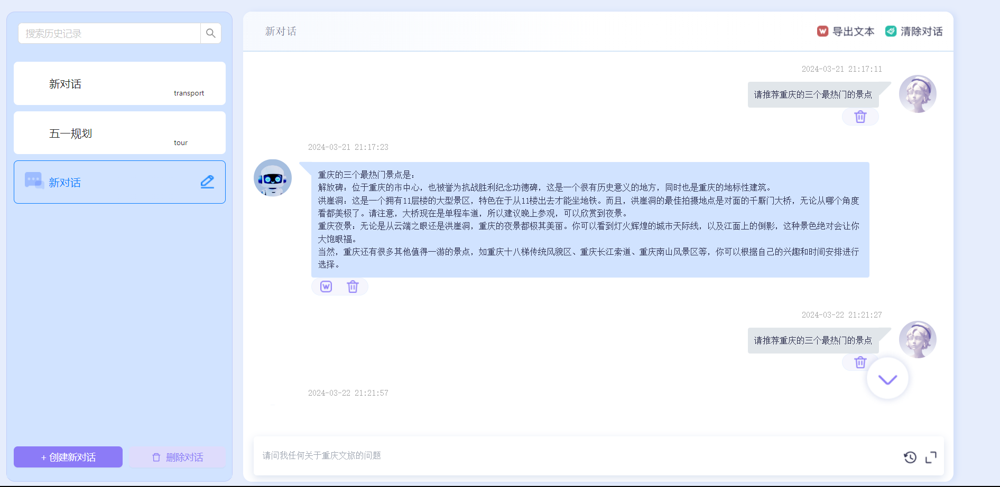
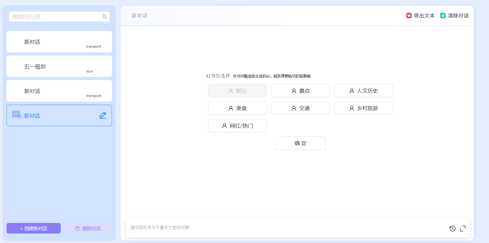

# 一个基于通义千问的类GPT的SPA应用

## 实现功能：

1. **不同语料库的对话：** 可选择更贴切提问者问题内容的语料库主题，联系上下文，做出切合问题的优质回答。

2. **类GPT流的回答：** GPT流式回答与等待，自动转化md格式。

3. **优秀的用户体验：** 无痛刷新，最大程度减少加载，一键导出对话为word，一键删除以及自定义会话标题。

## 亮难点：

- **GPT式回答**，通过后端流式传输AI回答，通过打字机样式段落式进行渲染。难点在于AXIOS基于的XML不支持Post流式传输，只能换成Fetch的api-`getReader()`进行读取流式传输。
  同时还需要判断当前对话进度，控制打字机样式的运用以及回答结束后的渲染。

- **最大程度的用户体验**， 双Token实现无痛刷新，通过axios拦截器实现。会话切换，创建与删除通过本地先存储，后再进行网络请求，最大程度上减少请求阻塞时间，提高用户体验。

- **MD格式转化** 后端返回md格式可以通过marked转化成HTML插入div中进行渲染或者直接利用marked-react进行jsx渲染。

## 应用截图：

  

  

